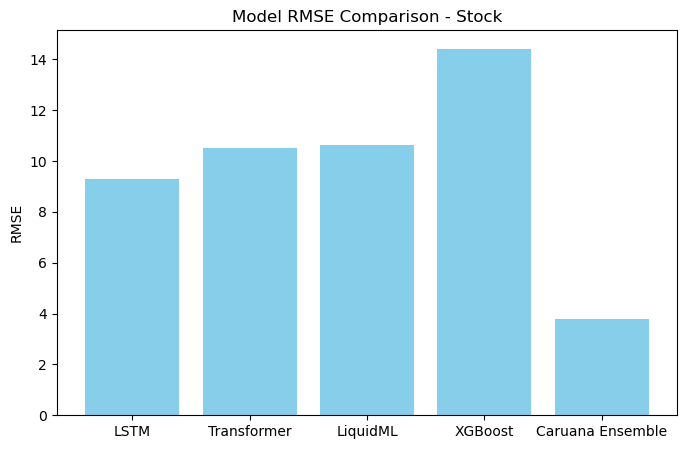

# ForecastForge

**A Hybrid Time Series Forecasting Framework for Real-World Use Cases**

ForecastForge is an extensible, research-inspired framework built to tackle complex forecasting problems found in industries like energy, finance, transportation, and meteorology. It integrates traditional machine learning and modern deep learning models, layered with powerful ensemble techniques, to deliver high-performance forecasts on real-world datasets.

---

## 🚀 Project Overview

Time series data is everywhere—from electricity consumption and traffic congestion to stock fluctuations and climate monitoring. Yet forecasting such data is inherently difficult due to non-linearity, noise, and abrupt pattern changes.

**ForecastForge is built to address this challenge through:**

- A modular architecture that supports classical, deep learning, and hybrid models.
- A comparative framework that evaluates model performance on diverse datasets.
- An emphasis on ensemble methods to combine strengths of individual models.

---

## 🧠 Models Implemented

### 1. LSTM (Long Short-Term Memory)
- Designed for capturing long-term dependencies in sequential data.
- Deployed across datasets like weather, stock, traffic, and energy.

### 2. Transformer
- Uses self-attention mechanisms for sequence modeling.
- Adapted for univariate time series forecasting tasks.

### 3. XGBoost
- A high-performance boosting algorithm effective on structured temporal data.
- Used as a baseline and ensemble input.

### 4. LiquidML (Custom Meta-Ensemble)
- ForecastForge’s core ensemble learner.
- Aggregates predictions across models using Caruana’s Ensemble Selection, optimized for RMSE.

### 5. Ensemble Methods Explored
- Caruana’s Ensemble Selection ✅ *(Best Performer – used in final evaluation)*
- Others (archived under `Deprecated Ensembles/`):
  - Bayesian Model Averaging
  - Weighted Voting
  - Blending
  - Median Ensemble
  - Voting
  - Stacked Ensemble
  - Weighted Averaging
  - Stacked Weighted Voting

---

## 📊 Datasets

ForecastForge uses pre-cleaned datasets reflecting real-world forecasting challenges:

- `AEP_hourly_processed.xlsx`: Hourly U.S. electricity consumption data.
- `Tesla_Stock.xlsx`: Daily Tesla stock prices.
- `jena_climate.xlsx`: Environmental sensor data from Jena, Germany.
- `traffic.xlsx`: Hourly road traffic volume dataset.

➡ All datasets are stored under `datasets/` in ready-to-use format.

---

## 📈 Evaluation Metrics

ForecastForge evaluates all models using:

- **Root Mean Square Error (RMSE)**: Primary metric for accuracy.
- Results are saved in individual `RMSE_*.json` files within each model’s subdirectory.

📊 Below is a comparative performance chart of all implemented models on the stock dataset:

  
*Lower RMSE indicates better performance.*

---

## 🌐 Gradio Interface

A clean Gradio-based web app allows users to:

- Select the dataset.

- Choose which models to incorporate in the ensemble

- Live Demo:    [](https://huggingface.co/spaces/namankr24/ForecastForge).

- Interface Preview of the Gradio App
  

---

## 🛠️ Setup Instructions

1. **Clone the Repository**
   ```bash
   git clone https://github.com/NamanKr24/ForecastForge.git
   cd ForecastForge
   ```

2. **Create a Virtual Environment**
   ```bash
   python -m venv venv
   source venv/bin/activate  # On Windows: venv\Scripts\activate
   ```

3. **Install Dependencies**
   ```bash
   pip install -r requirements.txt
   ```

4. **Run Jupyter Notebooks**
   ```bash
   jupyter notebook
   ```

Make sure Jupyter Notebook is installed in your environment.

---

## 📌 Key Features

- ✅ **Model Modularity**: Add or remove models without changing the core workflow.

- ✅ **Ensemble Experimentation**: 9 ensemble strategies implemented and evaluated.

- ✅ **Real-World Readiness**: Focused on robustness, not just benchmark datasets.

- ✅ **Organized Repo**: Clear directory structure and reproducible pipelines.

---

## 🤝 Contributing

Contributions are welcome! Please follow these steps:

1. Fork the repository.

2. Create a new branch:
   ```bash
   git checkout -b feature/YourFeature
   ```

3. Commit your changes:
   ```bash
   git commit -m "Add YourFeature"
   ```

4. Push to the branch:
   ```bash
   git push origin feature/YourFeature
   ```

5. Open a pull request.

---

## 📄 License

This project is licensed under the [MIT License](LICENSE).

---

## 📬 Contact

Naman Kumar

📧 Email: namankr24@gmail.com

🔗 GitHub: NamanKr24

---

Crafted with dedication to advance time series forecasting methodologies.
